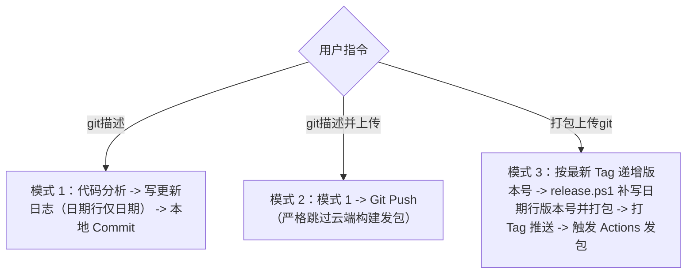

# StockPlusPlus Git 描述与版本发布工作流

本技能专为 `StockPlusPlus` 股票行情插件设计，用于智能化提炼代码改动、自动维护「关于插件」页面的更新日志，并管理本地提交、免构建上传与云端 CI/CD 发包全生命周期。

---

## 触发命令与行为规范

本技能根据用户指令的核心意图，严格分为三种执行模式：



---

> **版本号铁律（必须遵守）**
> - 更新日志的日期行，日常提交**只写日期**（`L"YYYY-MM-DD"`），**不写版本号**；
> - `Plugins/Stock/Version.h` 只代表「最后一次发包的版本」，日常提交**不得手工改动**；
> - 版本号只在【打包上传git】时由 `tools/release.ps1` 统一补写：日期行加 `(vX.Y.Z)`、同时覆写 `Version.h`，
>   版本基准取**最新 Git Tag +1**——提前写版本号会让 GitHub 发布号跳档
>   （例：日志已标 v2.0.9 却从未发布，下次发包直接成 v2.0.10，v2.0.9 永久缺失）。

### 模式一：当用户说【git描述】

**目标**：自动识别当前未提交改动，将关键改动点规范追加到插件更新日志中，然后完成本地 Git Commit。

#### 执行步骤：
1. **分析改动**：
   - 执行 `git status -s` 和 `git diff`（包括未暂存与已暂存改动）；
   - 若工作区完全干净（无任何修改），直接提示用户无需更新；
   - 提取代码实质改动，归纳为 1~4 条规范条目，格式必须符合：
     - `•  【新增】 <功能要点描述>`
     - `•  【优化】 <体验或性能要点描述>`
     - `•  【修复】 <问题修复要点描述>`
2. **同步更新日志**：
   - 定位文件：`Plugins/Stock/ManagerDialog.cpp` 中的 `DrawAboutPage()`；
   - 获取当前系统日期（如 `YYYY-MM-DD`）；
   - 在 `kItems_MMDD` 和 `kAboutLogGroups[]` 中：
     - 若今天日期已有条目组，将提炼的新条目智能合并/追加到该组；
     - 若今天为新日期，创建新的 `kItems_MMDD` 并将其置于 `kAboutLogGroups[]` 顶部；
     - 日期行**只写日期**（`L"YYYY-MM-DD"`），**不写版本号**：版本号只在发包时由 `release.ps1` 追加；
     - 关于页高度由 `MeasureAboutPageHeight()` 按日志内容自动量算，无需手工调整任何常量；
   - **不要改动 `Plugins/Stock/Version.h`**：它只代表「最后一次发包的版本」，只在发包时由 `release.ps1` 覆写；
3. **本地 Git 提交**：
   - 执行 `git add -A` 暂存所有修改（包括代码改动与更新日志）；
   - 按照 Conventional Commits 规范生成提交信息（如 `feat(stock): ...` 或 `fix(stock): ...`）；
   - 执行 `git commit -m "..."`；
4. ⚠️ **严格禁止执行 `git push`**，流程在本地终结，向用户汇报提交详情与更新日志内容。

---

### 模式二：当用户说【git描述并上传】

**目标**：执行更新日志写入并推送到远程仓库，**严格跳过云端构建和发包脚本**。

#### 执行步骤：
1. **执行模式一全部动作**：
   - 自动识别当前改动 -> 提取更新要点 -> 写入 `ManagerDialog.cpp` 更新日志 -> 本地 `git commit`；
2. **推送到远程**：
   - 获取当前分支：`git branch --show-current`；
   - 执行推送：`git push origin <当前分支>`；
3. **免构建保障**：
   - 项目的 GitHub Actions 工作流（`.github/workflows/build-and-release.yml`）仅监听 `tags: ['v*']`，普通分支推送绝对不会触发任何云端构建或 Release 发布；
   - 确认推送成功后，明确告知用户：**代码与更新日志已同步上传，云端编译发包已安全跳过**。


### 模式三：当用户说【打包上传git】

**目标**：按最新 Git Tag 递增（或由用户指定）正式版本号，由 `release.ps1` 给日志日期行补写版本号并打包本地产物，打上 Git Tag 推送至 GitHub，同时触发云端 Actions 矩阵构建发布 Release。

#### 执行步骤：
1. **确定目标版本号**：
   - 用户命令中若包含版本号（如 `打包上传git 2.1`），则采用用户指定的版本号；
   - 若用户未显式指定，按**最新 Git Tag** 递增修订号（`git tag -l "v*.*.*" --sort=-v:refname` 取首个，如 `v2.0.8` -> `2.0.9`）；`release.ps1` 亦按此规则自动推导，保证与 GitHub 发布号连续；
2. **日志闭环与前置更新（核心保障）**：
   - 检查 `Plugins/Stock/ManagerDialog.cpp` 中 `kAboutLogGroups[]` 顶部是否已有覆盖本次改动的日志分组（**日期行不带版本号**，由脚本发布时补写）；
   - 若自上一 Tag 以来有新提交、或当前工作区仍有未写入日志的改动：
     - 自动执行 `git log $(git describe --tags --abbrev=0 2>$null)..HEAD` 分析所有改动；
     - 提炼 1~4 条规范条目（`•  【新增】...`、`•  【优化】...`、`•  【修复】...`）；
     - 在 `DrawAboutPage` 顶部创建全新的 `kItems_MMDD` 数组（同日已有分组时以 `kItems_MMDD_v<版本>` 区分），并作为首个元素插入 `kAboutLogGroups[]`；日期行**只写日期**（`L"YYYY-MM-DD"`），不要手写版本号；
     - 关于页高度已自动量算（`MeasureAboutPageHeight()`），无需手工调整；
   - **严格确保在调用 `release.ps1` 之前，更新日志已覆盖本次全部改动**：脚本会自动给顶部无版本号的日期分组补上本次版本号，并随 DLL 一起编译发布；
3. **运行发包脚本**：
   - 调用发包脚本：
     ```powershell
     powershell -ExecutionPolicy Bypass -File "tools/release.ps1" -Version <目标版本号>
     ```
   - 脚本将自动完成：
     - 覆写 `Plugins/Stock/Version.h` 为全新版本宏（日常提交不得手工改它）；
     - 给日志顶部待发布的日期分组补写本次版本号（`L"YYYY-MM-DD (v<目标版本>)"`），随 DLL 一起编译进「关于插件」页；
     - 关闭运行中的测试器释放文件占用；
     - MSBuild 编译 x64 和 x86 Release 动态库（包含最新内置更新日志）；
     - 自动清理历史 zip，打包至 `download/Stock_V<版本>_x64.zip` 与 `download/Stock_V<版本>_x86.zip`；
     - 同步更新 `download/plugin_download.md` 下载列表；
     - 自动提取本次版本号对应分组的更新日志生成 `RELEASE_NOTES.md`（提取不到会直接报错，杜绝发布空说明）；
4. **提交发包改动**：
   - `git add -A`
   - `git commit -m "chore(release): bump version to v<目标版本号>"`
5. **创建并推送 Git Tag**：
   - 打上 Git Tag：`git tag v<目标版本号>`
   - 推送代码与 Tag：
     ```powershell
     git push origin <当前分支>
     git push origin v<目标版本号>
     ```
6. **云端 Actions 自动联动**：
   - GitHub Actions 感应到 `v*` 标签，自动创建 GitHub Release，将 `RELEASE_NOTES.md` 作为正文发布，并挂载全架构 zip 安装包供用户一键点击下载；
7. **向用户交付**：汇报新版本号、本地生成的 zip 产物，以及 GitHub Release 下载链接。
